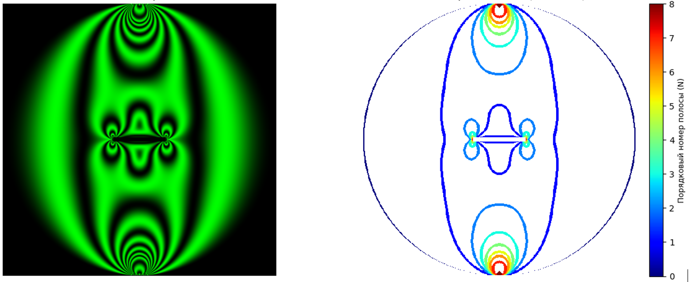

# Лабораторная работа №1
 **ФИО:** Шестерина Софья Сергеевна

 **Группа:** 6405-010302D
 
 **Научный руководитель:** Степанова Лариса Валентиновна
 
 **Предполагаемая тема диплома:** Сверточные нейронные сети для реконструкции изображений, получаемых экспериментальными методами механики
 
> «Нож – самое прочное, самое бессмертное, самое гениальное из всего, созданного человеком. Нож – был гильотиной, нож – универсальный способ разрешить все узлы, и по острию ножа идет путь парадоксов – единственно достойный бесстрашного ума путь…»
>
> 
<i>— Д-503, Е.И. Замятин "Мы"</i>

